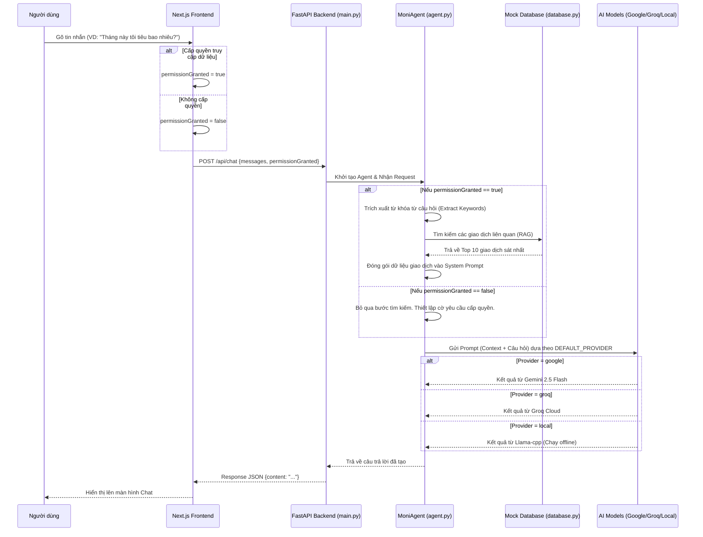

# Kiến trúc và Luồng hoạt động của AI Agent (Moni)

Tài liệu này giải thích cách con Agent AI của bạn (Moni) hoạt động, từ lúc người dùng gõ tin nhắn ở Frontend cho đến khi AI trả lời.

## Tổng quan Kiến trúc

Dự án hiện tại được chia làm 2 phần hoàn toàn độc lập:
1. **Frontend (Next.js)**: Chịu trách nhiệm hiển thị giao diện UI/UX. Không chứa bất kỳ logic AI nào.
2. **Backend (Python FastAPI)**: Chứa bộ não của Agent. Nơi đây nhận yêu cầu từ Frontend, tìm kiếm dữ liệu (RAG), và giao tiếp với các LLM.

---

## Sơ đồ luồng hoạt động (Agent Flow)

---

## Chi tiết các bước xử lý bên trong `MoniAgent`

Bên trong file `backend/agent.py`, luồng suy nghĩ của Agent diễn ra như sau:

### Bước 1: Quyết định "Bộ não" (LLM Routing)
Khi khởi tạo `MoniAgent`, nó sẽ đọc file `.env` biến `DEFAULT_PROVIDER`.
- Nếu là `google`: Tải SDK `google-genai`.
- Nếu là `groq`: Tải SDK `groq`.
- Nếu là `local`: Khởi động model `.gguf` chạy bằng sức mạnh máy tính của bạn.

### Bước 2: Kỹ thuật RAG (Retrieval-Augmented Generation)
Để AI không trả lời "ảo" (hallucination) về số dư hay lịch sử tiêu tiền, nó cần dữ liệu thực.
1. Hàm `extract_keywords`: Agent đọc câu hỏi của User, loại bỏ các từ vô nghĩa (tôi, bạn, là, có, không,...).
2. Hàm `retrieve_relevant_context`: Agent lấy các từ khóa còn lại đem so sánh với toàn bộ các giao dịch trong `database.py`.
3. Tính điểm (Score): Giao dịch nào chứa nhiều từ khóa giống câu hỏi nhất sẽ được xếp hạng cao.
4. Trả về đúng **10 giao dịch liên quan nhất** để nhét vào Prompt (Tránh việc nhét toàn bộ database làm tràn bộ nhớ AI và tốn tiền API).

### Bước 3: Định hình nhân cách và Luật lệ (System Instruction)
Agent lắp ráp dữ liệu RAG tìm được vào một Prompt Tổng chứa các luật lệ vô cùng nghiêm ngặt:
- **Luật 1 (Bảo mật)**: Nếu Frontend truyền lên `permissionGranted=False`, AI bị cấm bịa số liệu. Nó bắt buộc phải sinh ra chuỗi `<<PERMISSION_REQUEST>>` để Frontend hiện nút "Cấp quyền".
- **Luật 2 (Gợi ý)**: Nếu user khai báo khoản chi, AI không tự quyết định mà phải nhả ra chuỗi `<<CLASSIFY_SUGGESTION>>` để Frontend hiển thị các Nút chọn danh mục cho người dùng tự bấm.

### Bước 4: Gọi Model và trả kết quả
Toàn bộ thông tin trên được nén lại và gửi cho LLM. LLM đọc hiểu ngữ cảnh, dữ liệu giao dịch và trả về đoạn text cuối cùng về cho điện thoại/web của người dùng.
